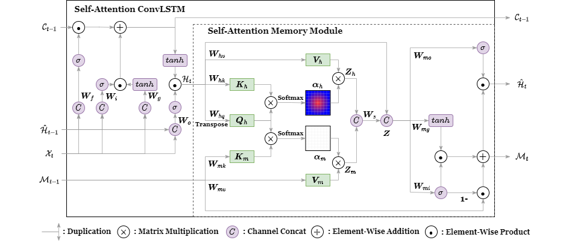

# Overview

- Pytorch implementation of [Self-Attention ConvLSTM for Spatiotemporal Prediction](https://ojs.aaai.org/index.php/AAAI/article/view/6819/6673).
- Pytorch implementation of [ConvLSTM](https://arxiv.org/abs/1506.04214v2).

(testing on MovingMNIST)

## Examples

### Training and Evaluation of Self-Attention ConvLSTM (with memory module)

```bash
python -m pipelines.moving_mnist_pipeline.self_attention_memory_convlstm
```

### Training and Evaluation of ConvLSTM
```bash
python -m pipelines.moving_mnist_pipeline.convlstm
```

## Directories

## `convlstm/`

ConvLSTM implementation based on [Convolutional LSTM Network: A Machine Learning Approach for Precipitation Nowcasting](https://paperswithcode.com/paper/convolutional-lstm-network-a-machine-learning).

## `self_attention_convlstm/`

Self Attention ConvLSTM implementation based on [Self-Attention ConvLSTM for Spatiotemporal Prediction](https://ojs.aaai.org/index.php/AAAI/article/view/6819/6673).

## `self_attention_memory_convlstm/`

Self-Attention ConvLSTM (with memory module) implementation based on [Self-Attention ConvLSTM for Spatiotemporal Prediction](https://ojs.aaai.org/index.php/AAAI/article/view/6819/6673).

## Visualized Attention Maps



The above figure is SAM-ConvLSTM formulation process. alpha_{h} in the figure is
used for visualizing attention maps in evaluation (`pipeline/evaluator.py`). Also see the
following files for all calculation process.

- `self_attention_memory_convlstm/cell.py`
- `self_attention_memory_convlstm/model.py`
- `self_attention_memory_convlstm/self_attention_memory.py`
